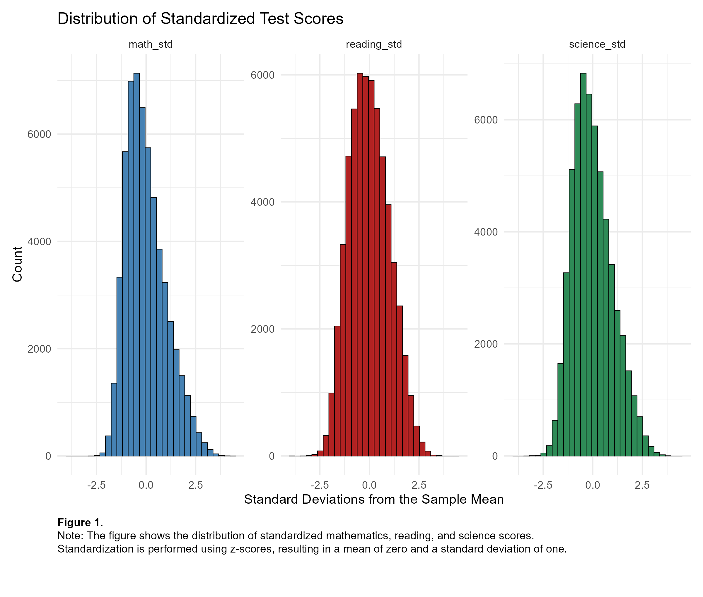
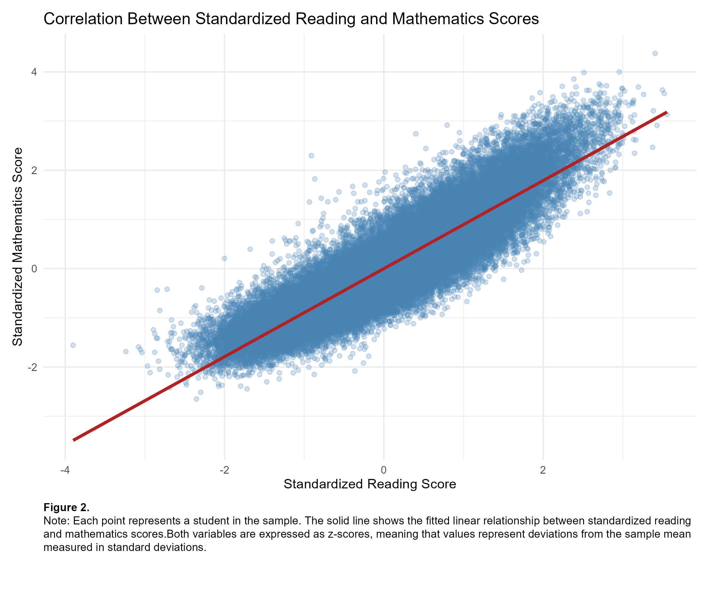
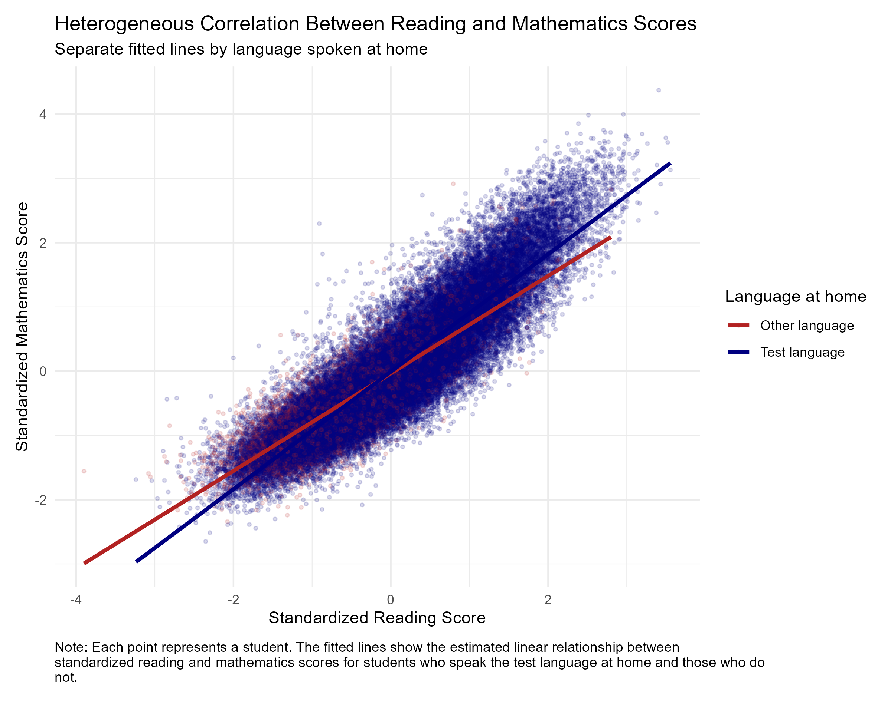

## Dataset

The analysis uses data from the OECD Programme for International Student Assessment (PISA), an international survey measuring mathematics, reading and science performance of 15-year-old students across countries.

# PISA Education Outcomes Analysis

This project analyzes educational outcomes using PISA 2022 data across eight countries.  
The analysis was conducted in R as part of a Quantitative Research Methods project.

## Research Question

How do factors such as reading ability, language spoken at home, ICT resources, and socioeconomic conditions affect student mathematics performance?

## Methods

The project applies several econometric techniques:

- Data standardization (z-scores)
- Descriptive statistics
- Data visualization
- OLS regression
- Multivariate regression
- Interaction models
- Instrumental variables (IV) estimation
- Heteroskedasticity-robust standard errors

## Tools

Analysis performed in:

- R
- dplyr
- ggplot2
- modelsummary
- sandwich
- lmtest
- AER
- flextable

## Key Findings

- Reading ability is strongly correlated with mathematics performance.
- Access to ICT resources is positively associated with student outcomes.
- Socioeconomic conditions such as food availability influence academic performance.
- Instrumental variable analysis suggests the ICT-performance relationship is likely associative rather than strictly causal.

## Repository Structure

**pisa_case_analysis.R**  
Main R script containing the full econometric analysis.

**report/**  
- `QRM_III_PISA_Education_Outcomes.pdf` – Final written report of the analysis.

**figures/**  
- `score_distributions.png` – Distribution of standardized test scores.  
- `reading_math_correlation.png` – Correlation between reading and mathematics scores.  
- `interaction_effects.png` – Interaction model results by language spoken at home.

## Example Visualization
### Distribution of Standardized Test Scores
This figure shows the distribution of standardized mathematics, reading, and science scores.

### Correlation between Reading and Math Scores
This figure shows the distribution of standardized mathematics, reading, and science scores.

### Interaction between test-taker native languages
This figure shows the interaction between students who natively speaks the test language, and students who do not natively speak the test language.

## Data

The raw dataset is not included in this repository.  
Please obtain the original PISA dataset separately before running the analysis.

## Authors

Kevin Pinto  & David Oldewarris
Vrije Universiteit Amsterdam – Economics
